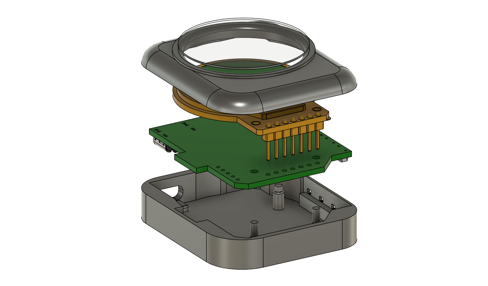
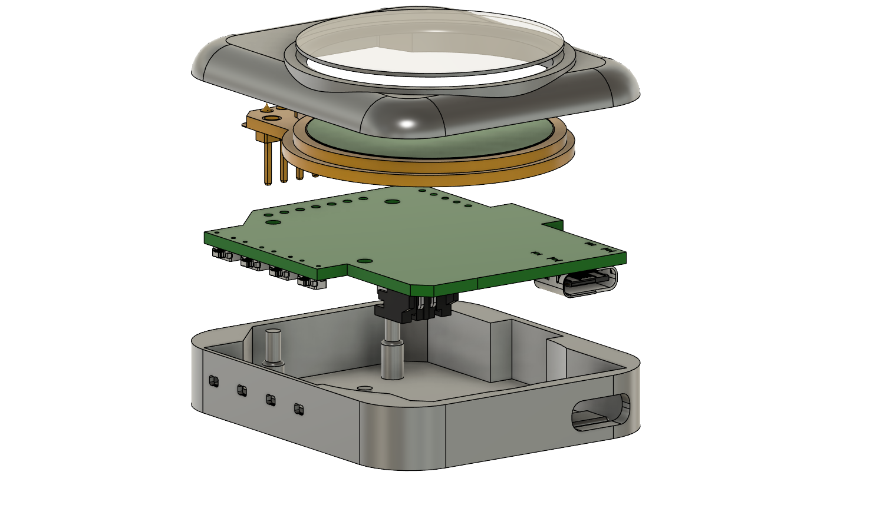

# Smartwatch With Round Screen 
This repository contains the design and firmware for a low-power smartwatch featuring an Round  display(TFT GC9A01, SPI), Bluetooth Low Energy (BLE) connectivity, and various sensors. The system is optimized for long battery life, leveraging the low power consumption of an efficient power management system.
The 3D modeling was made using Fusion 360:

